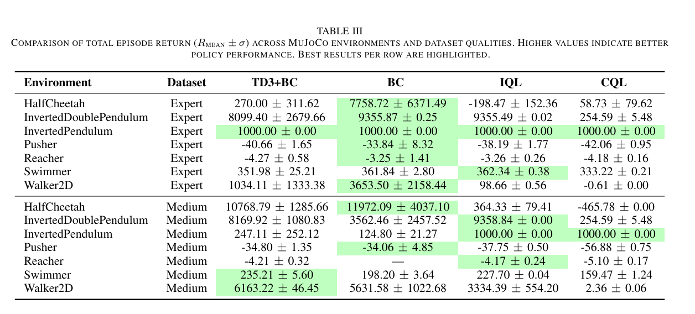
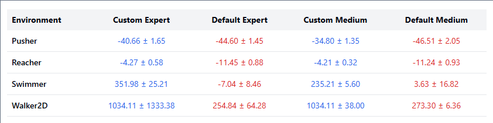

# Comparative Analysis of Offline RL Algorithms: BC, CQL, IQL, and Enhanced TD3+BC



*For each run, we record the training loss and episodic rewards, then aggregate the results across 10 runs to report the mean and standard deviation for both the learning curves and final performance.*

## Project Overview
Offline Reinforcement Learning (Offline-RL) enables agents to learn optimal policies from pre-collected datasets without further interaction with the environment. In this work, we conduct a comprehensive evaluation of several offline learning methods. We compare three state-of-the-art Offline-RL algorithms—TD3+BC, Implicit Q-Learning (IQL), and Conservative Q-Learning (CQL)—against a Behavioral Cloning (BC) baseline on standard benchmark datasets. We additionally implement a custom version of TD3+BC with enhancements including dynamic hyperparameter selection, BC weight annealing, explicit state normalization, and episode filtering. 

<table>
  <tr>
    <td align="center">HalfCheetah</td>
    <td align="center">Swimmer</td>
    <td align="center">Walker</td>
  </tr>
  <tr>
    <td></td>
    <td></td>
    <td></td>
  </tr>
</table>

<p align="center">
  <em>Agents trained on medium datasets using the enhanced TD3+BC algorithm.</em>
</p>

Experimental results demonstrate that TD3+BC substantially outperforms BC in high-sensitivity environments such as Walker2D and HalfCheetah, while IQL and CQL achieve superior performance on other tasks. Comparison with the legacy d3rlpy implementation confirms the effectiveness of our custom enhancements. These findings emphasize the importance of algorithmic adaptation and dataset quality in Offline-RL and provide guidance for robust offline policy learning.

## Background on Offline RL
Offline reinforcement learning addresses settings where online data collection is expensive, risky, or infeasible. Notable approaches include:
-   **Behavioral Cloning (BC)**: A supervised learning method that imitates expert trajectories directly without value function learning [1].
-   **TD3+BC**: Combines Twin Delayed Deep Deterministic Policy Gradient (TD3) with behavioral cloning to mitigate distributional shift [2].
-   **Implicit Q-Learning (IQL)**: Uses expectile regression and implicit Q-Learning to avoid explicit policy constraints, enabling stable offline learning [3].
-   **Conservative Q-Learning (CQL)**: Learns conservative Q-functions to prevent overestimation of out-of-distribution actions [4].

## Algorithms Implemented
We evaluate three state-of-the-art Offline-RL algorithms (TD3+BC, IQL, and CQL) and compare them against Behavioral Cloning (BC), a common imitation learning baseline. Each algorithm employs a distinct strategy for learning from offline datasets.

### Default TD3+BC (`d3rlpy`)
-   **Description**: This is a standard TD3+BC implementation based on the popular `d3rlpy` library. It combines the TD3 actor-critic algorithm with a behavioral cloning term to regularize the policy.
-   **Implementation**: `TD3PlusBC/default.py`
-   **Provides a baseline** for comparison against the custom implementation.

### Custom TD3+BC Implementation
Our implementation introduces several modifications that vary based on dataset quality.

#### 1. Dynamic Hyperparameter Selection
The `choose_profile()` function selects hyperparameters based on dataset name matching. Expert and medium datasets receive distinct configurations for batch size, BC weight, policy noise, and lambda clipping bounds.

```python
# Default configuration inherited by all profiles
cfg = dict(
    label="DEFAULT", alpha=1.5, bc_weight=2.0, bc_warmup=0,
    policy_noise=0.08 * max_action, noise_clip=0.25 * max_action,
    policy_freq=2, episode_filter_frac=0.0,
    target=900.0, batch_size=256, lambda_clip=(0.0, 10.0),
    discount=0.99, tau=0.005
)
# ...
```

#### 2. BC Weight Annealing
The BC weight anneals linearly during the first 5000 training steps to 50% of its initial value, then remains constant.

```python
progress = min(1.0, self.total_it / 5000.0)
bc_w = self.bc_weight * (1.0 - 0.5 * progress)
# ...
```

#### 3. Explicit State Normalization
State observations are normalized using dataset-wide mean and standard deviation.

```python
def normalize_states(self, eps=1e-6):
    mean = self.state[:self.size].mean(0, keepdims=True)
    std = self.state[:self.size].std(0, keepdims=True) + eps
    # ...
```

#### 4. Episode Filtering for Medium Datasets
Episodes are filtered by cumulative return using quantile thresholding. Medium datasets retain the top 50% of episodes, while expert datasets use no filtering.

```python
def filter_topk_by_return(ds, keep_frac=0.8):
    # ...
```



## How to Run the Code
Each algorithm is implemented in a self-contained script.

### 1. Behavioral Cloning
To run the BC experiment:
```bash
python "behavior cloning/bc.py"
```

### 2. CQL and IQL
To run the CQL and IQL experiments:
```bash
python CQL_IQL/cql_iql.py
```

### 3. TD3+BC
-   **To run the default TD3+BC implementation:**
    ```bash
    python TD3PlusBC/default.py
    ```
-   **To run the custom TD3+BC implementation:**
    ```bash
    python TD3PlusBC/custom_TD3PlusBC.py
    ```

## Conclusion
We present a comprehensive evaluation of three state-of-the-art Offline-RL algorithms and a Behavioral Cloning baseline. TD3+BC with our proposed enhancements consistently outperforms BC in high-sensitivity tasks, while IQL and CQL demonstrate strong performance on additional benchmarks. These results underscore the importance of algorithmic adaptation and dataset quality for robust offline policy learning. Future work will investigate adaptive data selection and automated hyperparameter optimization for improved generalization across tasks.

## References
1. D. Pomerleau, “Alvinn: An autonomous land vehicle in a neural network,” in Advances in Neural Information Processing Systems, 1988.
2. S. Fujimoto and S. Gu, “A minimalist approach to offline reinforcement learning,” in Advances in Neural Information Processing Systems, 2021.
3. I. Kostrikov, A. Nair, and S. Levine, “Offline reinforcement learning with implicit q-learning,” in Proc. International Conference on Learning Representations (ICLR), 2022.
4. A. Kumar, A. Zhou, G. Tucker, and S. Levine, “Conservative q-learning for offline reinforcement learning,” in Advances in Neural Information Processing Systems, 2020.
5. M. L. Puterman, Markov Decision Processes: Discrete Stochastic Dynamic Programming. Wiley, 1994.
6. S. Levine, A. Kumar, G. Tucker, and J. Fu, “Offline reinforcement learning: Tutorial, review, and perspectives on open problems,” arXiv preprint arXiv:2005.01643, 2020.
7. S. Fujimoto and S. S. Gu, “A minimalist approach to offline reinforcement learning,” 2021. [Online]. Available: https://arxiv.org/abs/2106.06860
8. S. Fujimoto, H. van Hoof, and D. Meger, “Addressing function approximation error in actor-critic methods,” in Proc. International Conference on Machine Learning (ICML), 2018.
9. I. Kostrikov, A. Nair, and S. Levine, “Offline reinforcement learning with implicit q-learning,” 2021. [Online]. Available: https://arxiv.org/abs/2110.06169
10. A. Kumar, A. Zhou, G. Tucker, and S. Levine, “Conservative q-learning for offline reinforcement learning,” 2020. [Online]. Available: https://arxiv.org/abs/2006.04779
